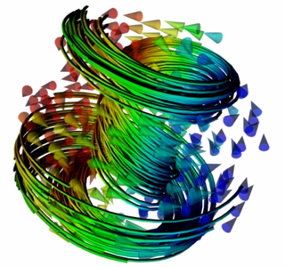

Python for Computational Science and Engineering
================================================

The content of [this book](https://github.com/fangohr/introduction-to-python-for-computational-science-and-engineering/blob/master/Readme.md) is distributed into chapters, using one Jupyter Notebook for each chapter.

If you have not used the Jupyter Notebook before, please read the section "First steps with Jupyter Notebook" below before you proceed.

You can use the links below to jump directly to these notebooks to read the book, and to change all examples as you like.

*First steps with Jupyter Notebook*

1. Navigating the notebook

When you open a notebook, you will find that you can move a highlighted block (with a blue line at the left) with the cursor keys to move up and down. This block highlights a *cell*. (You can also use the mouse to select a cell.) This is called the [Command mode](https://jupyter-notebook.readthedocs.io/en/stable/examples/Notebook/Notebook%20Basics.html#Command-mode).

2. Executing code

If you want to execute a cell (for example one that contains some Python code), you can press `Shift+ENTER`. If the cell creates some output, it will be displayed below the cell. (You may not notice if it just updates output that was displayed before, in particular if the new output is the same as the old output.)

3. Editing code

If you want to *change* the code in the currently highlighted cell, you need to press `ENTER`. You have now entered the [Editing mode](https://jupyter-notebook.readthedocs.io/en/stable/examples/Notebook/Notebook%20Basics.html#Edit-mode), and the content of the cell can be edited. If you have completed your changes, and you want to execute them, use the `Shift+ENTER` short cut.

Note that you can also edit blocks of text (or go into edit mode for a text cell unintentionally). Just press `Shift+ENTER` to render the text again, and go back into command mode.

*Warning: Changes on mybinder are temporary*

If you use this text book interactively on the mybinder service, then you have been given a temporary resource in the cloud to execute the code examples. The changes you have made to the notebook *will be lost* when your session ends (which is when you close the window, or the patience of the service has expired). Thus, the interactive exploration of the notebooks is good to help learn Python, computing and data science, but you should not attempt to write any code in these notebooks that you want to re-use the next day or later.

*Comments? Questions?*

For feedback, corrections, and questions please refer to the [home page](https://github.com/fangohr/introduction-to-python-for-computational-science-and-engineering/blob/master/Readme.md) of the book.

Enjoy!

<!-- markdown-link-check-disable -->

<!-- markdown-link-check-enable -->
